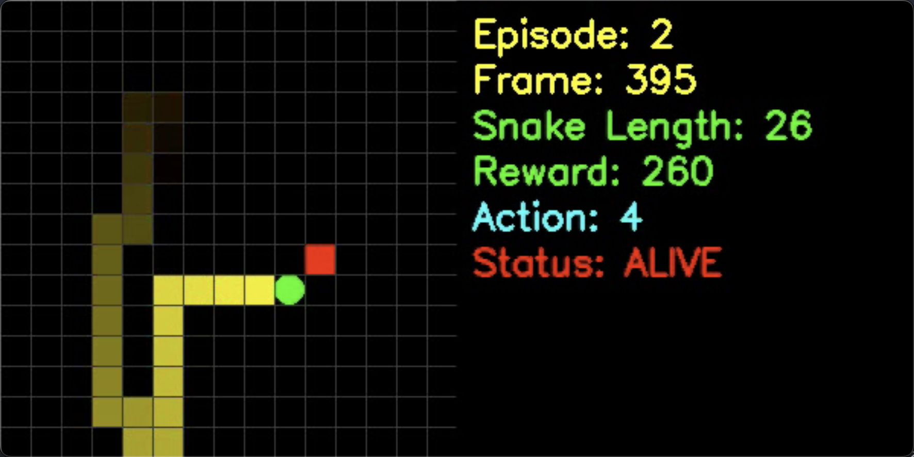
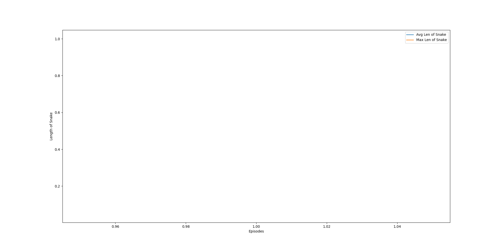
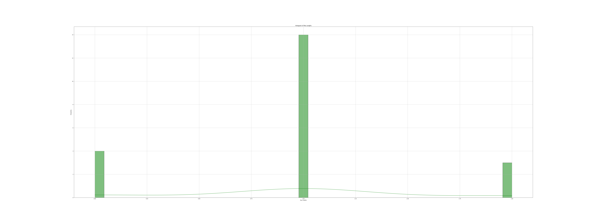
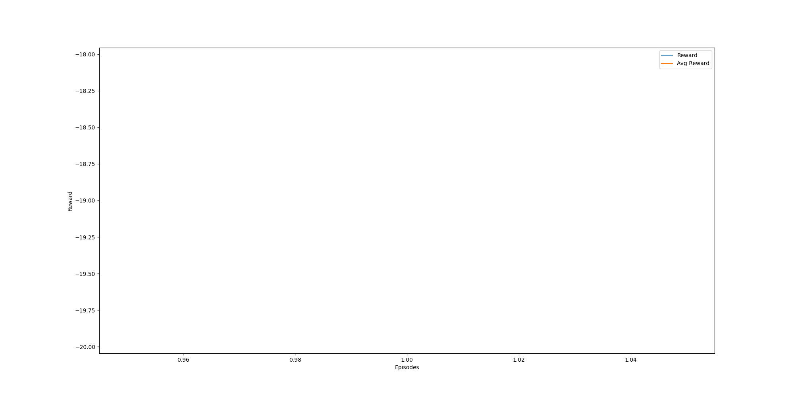

# RL-snack
强化学习贪吃蛇

## 概览




## 流程

强化学习贪吃蛇训练流程：

1. 首先，定义一个Q网络（QNetwork），它将贪吃蛇游戏的状态（包括蛇的位置和苹果的位置等）作为输入，输出每个动作的Q值（预测的奖励）。
2. 初始化贪吃蛇游戏环境（GameEnvironment）、经验回放（ReplayMemory）、优化器（Adam）和损失函数（MSELoss）。
3. 开始训练循环，进行多个回合（episode）的训练。
4. 在每个回合中，调用 `run_episode` 函数进行游戏回合，模拟贪吃蛇的行为。在每局游戏中，贪吃蛇根据当前状态（蛇的位置和苹果的位置）通过Q网络预测每个动作的Q值，并根据 ε-greedy策略（以一定概率随机探索，否则选择预测Q值最大的动作）来选择下一步的动作。然后执行动作，更新游戏状态，计算奖励和是否结束游戏，并将样本数据（状态、动作、奖励、下一个状态、是否结束）存储到经验回放中。
5. 在每个回合结束后，通过经验回放（Replay Memory）中的样本数据，调用 `learn` 函数来更新Q网络的权重，以逼近最优的Q值。`learn` 函数会使用批量的样本数据来计算损失函数，然后通过优化器来更新Q网络的权重。
6. 记录每个回合的得分和蛇的长度，并计算滑动窗口的平均得分和平均蛇的长度，用于评估训练的效果。
7. 循环训练直到达到预定的训练回合数（`NUM_EPISODES`）为止。
8. 在训练过程中，可以保存一些训练中间结果，如每隔一定回合保存一次模型的权重。
9. 训练完成后，获得训练过程中的得分、平均得分、平均蛇的长度和最大蛇的长度等数据，用于分析和可视化训练结果。


## 目录

```
.
├── Game.py
├── README.md
├── WatchAgent.py
├── WatchAgentVideo.py
├── config
│   └── config.py
├── dir_chk
│   ├── Snake_100
│   ├── Snake_2000
│   └── Snake_30000
├── model.py
├── npy
│   ├── avg_len_of_snake.npy
│   ├── avg_scores.npy
│   ├── max_len_of_snake.npy
│   └── scores.npy
├── outputImage
│   ├── drawAvgAndMaxLen.png
│   ├── drawMaxHist.png
│   └── drawScores.png
├── replay_buffer.py
├── requirements.txt
├── train.py
└── video
    └── snake_ai_info.mp4
```

## Gemini 2.5 Pro 讲解

### 1. 强化学习与Q-Learning入门

在深入代码之前，我们先快速过一下最核心的几个概念。

* **智能体 (Agent)**：在我们的项目中，就是**贪吃蛇**。它是学习者和决策者。
* **环境 (Environment)**：就是**游戏本身**，包括棋盘、苹果的位置等。
* **状态 (State)**：智能体在某一时刻所处的环境情况。对于贪吃蛇，状态可以包括蛇头的位置、蛇身的位置、苹果的位置以及蛇头周围是否有危险（墙壁或自己的身体）。
* **动作 (Action)**：智能体可以执行的操作。在贪吃蛇游戏里，就是**上、下、左、右**移动。
* **奖励 (Reward)**：智能体执行一个动作后，环境反馈给它的一个信号，用于评价这个动作的好坏。比如：
    * 吃到苹果：得到一个正奖励（比如 +10）。
    * 撞墙或撞到自己死掉：得到一个负奖励（惩罚，比如 -100）。
    * 什么都没发生，只是移动了一步：得到一个小的负奖励或0（鼓励蛇尽快找到苹果）。

**强化学习的目标**：智能体（贪吃蛇）的目标是学习一个**策略 (Policy)**，这个策略能告诉它在任何状态下，应该选择哪个动作，才能使得最终获得的**累计奖励（Total Reward）**最大化。简单说，就是学会一种玩法，让自己活得更久、吃得更多。

#### 什么是 Q-Learning 和 Deep Q-Network (DQN)？

* **Q-Learning**：是一种经典的强化学习算法。它的核心是学习一个叫做 **Q值（Q-value）** 的东西。
    * **Q(state, action)** 的含义是：在当前 `state` 状态下，执行 `action` 动作，预期未来能获得的总奖励是多少。
    * 如果我们知道了所有状态下、所有动作的Q值，那么在任何状态下，我们只需要选择那个Q值最大的动作去执行，就是最优策略了。
    * 在简单的游戏中，我们可以用一个表格（Q-Table）来存储所有 `(state, action)` 组合的Q值。但贪吃蛇游戏的状态空间太大了（蛇的位置、苹果的位置等组合起来是天文数字），表格存不下。

* **Deep Q-Network (DQN)**：这就是深度学习发挥作用的地方。我们不用表格来存储Q值，而是训练一个**神经网络**来预测Q值。
    * **输入**：游戏的状态 (State)。
    * **输出**：当前状态下，所有可能动作（上、下、左、右）的Q值。
    * 这个神经网络，我们就称之为 **Q网络 (Q-Network)**。这正是项目中 `model.py` 里定义的那个网络。

### 2. 项目代码逐一解析

#### **`Game.py`：定义游戏环境 (Environment)**

这个文件定义了强化学习所需的一切“硬件”：智能体（蛇）、目标（苹果）和它们所在的宇宙（游戏环境）。

* `SnakeClass`：定义了蛇的行为。
    * `__init__`: 初始化蛇的位置、方向和长度。
    * `move`: 更新蛇的位置。
    * `checkdead`: 判断蛇是否死亡（撞墙或撞自己），这是触发负奖励的关键事件。
    * `getproximity`: **这个函数非常关键**，它获取蛇头周围的环境信息，判断上下左右四个方向是否会立即导致死亡。这部分信息是构成“状态”的重要组成部分。

* `AppleClass`：定义了苹果。
    * `eaten`: 当苹果被吃掉后，它会重新生成在新的位置，并增加分数。这是触发正奖励的关键事件。

* `GameEnvironment`：将蛇和苹果组合在一起，构成了完整的游戏世界。
    * `__init__`: 定义了游戏规则，比如网格大小，以及最重要的**奖励机制** (`reward_apple`, `reward_dead`, `reward_nothing`)。
    * `update_boardstate`: 这是游戏的核心循环。它接收一个动作，然后更新游戏状态（移动蛇、判断是否吃到苹果、判断是否死亡），并返回相应的**奖励**和游戏是否结束的标志。

#### **`model.py`：定义大脑 (Q-Network)**

这个文件定义了贪吃蛇的“大脑”——一个用来预测Q值的神经网络。

* `QNetwork` 类：
    * 它是一个标准的全连接神经网络（也叫多层感知机），继承自 `torch.nn.Module`。
    * `__init__`: 定义了网络的结构，包括输入层维度(`input_dim`)、隐藏层维度(`hidden_dim`)和输出层维度(`output_dim`)。这里的 `output_dim` 就是动作的数量。
    * `forward`: 定义了数据如何通过网络传播，最终输出每个动作的Q值。

* `get_network_input` 函数：
    * 这个函数是连接 `Game.py` 和 `model.py` 的桥梁。它负责从游戏环境中提取信息，并将其转换成神经网络能够理解的数字向量，也就是**状态 (State)**的向量化表示。
    * 它将蛇头周围的环境信息 (`proximity`)、蛇头位置、苹果位置和蛇头方向拼接成一个向量，作为神经网络的输入。

#### **`replay_buffer.py`：构建记忆库 (Experience Replay)**

这是DQN算法中的一个关键技巧，叫做**经验回放 (Experience Replay)**。

* **为什么需要它？**
    1.  **打破数据相关性**：在游戏中，连续的状态是非常相似的，如果学完一步马上就用这个经验来更新网络，数据之间关联性太强，会导致训练不稳定。
    2.  **提高数据利用率**：玩游戏得到的每一步经验（尤其是那些关键的，比如吃到苹果或死亡）都很宝贵，我们希望反复利用它们来学习。

* `ReplayMemory` 类：
    * `push`: 智能体每执行一步，就会产生一条经验数据，格式为 `(state, action, reward, next_state, done)`，其中 `done` 表示游戏是否结束。这个函数将这条经验存入一个固定大小的缓冲区（buffer）中。
    * `sample`: 当我们训练网络时，不是用最新的一条经验，而是从缓冲区中**随机**抽取一批（a batch of）经验数据出来。这样就打破了数据间的时序关联，让训练更稳定。

#### **`train.py`：学习与训练过程**

这个文件是整个项目的核心，它把前面所有的模块（游戏、模型、记忆库）都串联起来，执行训练循环。

* `run_episode` 函数：
    * 模拟贪吃蛇玩一局完整的游戏。
    * 在游戏的每一步，它会根据**ε-greedy策略**来选择动作：
        * 有 ε 的概率**随机探索 (Exploration)**：随机选一个动作。这有助于发现新的、可能更好的玩法。
        * 有 1-ε 的概率**利用现有知识 (Exploitation)**：让Q网络预测当前状态下所有动作的Q值，然后选择Q值最大的那个动作。
    * 执行动作后，从环境中获得 `reward` 和 `next_state`，然后将这条完整的经验 `(state, action, reward, next_state, done)` 存入经验回放缓冲区 (`memory.push`)。

* `learn` 函数：
    * 这是真正进行**学习（更新神经网络权重）**的地方。
    * 它首先从 `ReplayMemory` 中随机采样一批数据 (`memory.sample`)。
    * 然后，它计算两个关键的值：
        1.  **预测Q值 (Q_expected)**：对于采样出的每一个 `state`，用Q网络预测它对应的 `action` 的Q值。
        2.  **目标Q值 (Q_targets)**：这是我们希望网络能预测出的“正确答案”。它的计算公式是 `Reward + γ * max(Q(next_state, all_actions))`。（γ 是一个折扣因子，表示未来的奖励没有现在的奖励重要）。
    * 最后，它计算这两个值之间的**均方误差损失 (MSELoss)**，并通过反向传播和优化器（Adam）来更新Q网络的权重，使得网络预测的Q值越来越接近目标Q值。

* `train` 函数：
    * 这是总指挥。它会进行成千上万个**回合 (episode)** 的训练。
    * 在每个回合中，先调用 `run_episode` 来玩游戏、收集经验，然后调用 `learn` 来学习和更新网络。
    * 它还会记录得分、蛇的长度等指标，用于评估训练效果。

#### **`WatchAgent.py`：观看训练成果**

这个文件用于加载已经训练好的模型，并让它来玩贪吃蛇游戏，将整个过程用Pygame可视化地展示出来，能直观地看到AI的学习成果。

#### **`WatchAgentVideo.py`：保存训练视频**

这个文件是对 `WatchAgentVideo.py` 的改写，添加了将游戏过程保存为视频的功能。

### 3. 训练结果解读

`README.md` 中展示的三张图是训练过程的可视化结果：

* `drawAvgAndMaxLen.png`: 这张图展示了随着训练回合数（episodes）的增加，蛇的**平均长度**和**最大长度**的变化趋势。可以看到，曲线整体是上升的，说明随着学习的进行，蛇确实变得越来越“聪明”，能够活得更久，吃得更多。
* `drawMaxHist.png`: 这是一个直方图，显示了在所有训练回合中，蛇达到的最大长度的分布情况。
* `drawScores.png`: 这张图展示了每个回合的**得分**以及滑动平均得分。和蛇的长度一样，得分的趋势也是上升的，这直接证明了强化学习算法的有效性。

### 总结

现在我们把整个流程串起来：

1.  **定义环境** (`Game.py`): 创建了贪吃蛇游戏世界和规则。
2.  **定义大脑** (`model.py`): 创建了一个神经网络（Q-Network），用于根据游戏状态，决策下一步该怎么走。
3.  **开始训练** (`train.py`):
    * 让贪吃蛇（Agent）在游戏里（Environment）瞎玩（随机探索）或者根据大脑的决策玩（利用知识）。
    * 把每一步的经历 `(状态, 动作, 奖励, 下一状态)` 存进记忆库 (`replay_buffer.py`)。
    * 不断地从记忆库里抽取一批过去的经验，用来训练大脑（更新Q-Network的权重），让大脑的决策越来越准，能获得更高的长期奖励。
4.  **观看结果** (`WatchAgent.py`): 训练完成后，加载训练好的大脑模型，看它如何“秀操作”。


## 训练结果








## 参考
https://github.com/Rafael1s/Deep-Reinforcement-Learning-Algorithms/tree/master/Snake-Pygame-DQN

